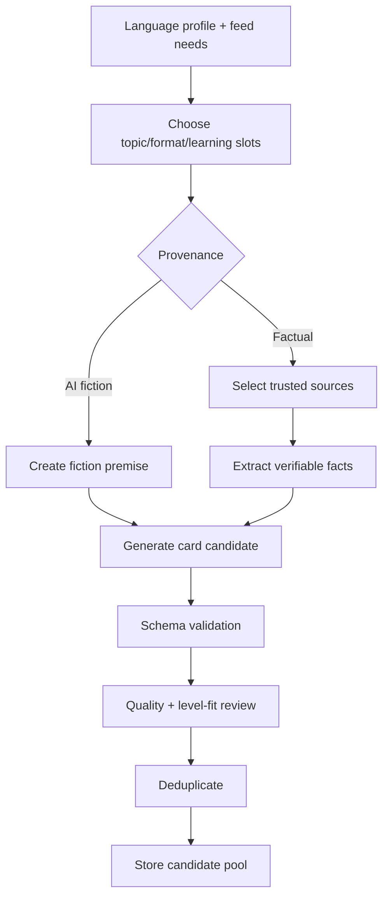

# AI-пайплайн карточек, blueprint и полного урока

## 1. Архитектурный принцип

Нужно разделить два процесса:

1. **Подготовка canonical карточек-идей** — дешёвая, быстрая, выполняется заранее и не принадлежит одному языку.
2. **Создание language-specific Lesson** — дорогая, запускается только после выбора пользователя и использует текущие `activeLanguage` + level snapshot.

Полный Lesson включает существующие тяжёлые этапы: текст, токенизацию, phrase groups,
аннотации, перевод, TTS, word-level timings, quality gate и Blob persistence.

## 2. Pipeline A: подготовка карточек



### Вход

```ts
interface CardGenerationRequest {
  desiredCount: number;
  requestedSlots: FeedSlot[];
  requestedLanguageContexts: Array<{
    language: LanguageCode;
    targetLevel: CEFRLevel;
    languageGoal: LanguageGoal;
    underexposedNodeCodes: string[];
  }>;
  enabledTopicIds: string[];
  enabledCountryOrRegionIds: string[];
  recentTopicIds: string[];
  recentFormats: ContentFormat[];
  interestSummary: InterestSummary;
  sourcePolicy: SourcePolicy;
}
```

### Выход

```ts
interface GeneratedCardCandidate {
  editorialTitleRu: string;
  editorialDescriptionRu: string;
  topicIds: string[];
  format: ContentFormat;
  regionTags: string[];
  provenanceType: ProvenanceType;
  estimatedReadingSeconds: number;
  learningFocusLabelRu: string;
  primaryLearningNodeCodes: string[];
  secondaryLearningNodeCodes: string[];
  whyInteresting: string;
  whyLevelAppropriate: string;
  sourceRefs?: SourceReference[];
  factualClaimsToVerify?: Array<{
    claim: string;
    sourceRefId: string;
  }>;
}
```

AI не может создавать произвольные `LearningNode` ids. Он выбирает только из списка,
переданного сервером.

## 3. Pipeline B: выбранная карточка → LessonBlueprint

`LessonBlueprint` является стабильным контрактом между рекомендательной системой
и существующим генератором уроков.

```ts
interface LessonBlueprintData {
  cardId: string;
  canonicalSubjectKey: string;
  language: LanguageCode;
  targetLevel: CEFRLevel;
  editorialTitleRu: string;
  targetLanguageTitle: string;
  format: ContentFormat;
  provenanceType: ProvenanceType;
  contentGoal: string;
  outline: string[];
  sourceRefs?: SourceReference[];
  sourceFacts?: Array<{ claim: string; sourceRefId: string }>;
  learningPassport: LessonLearningPassport;
  styleConstraints: {
    tone: 'calm' | 'neutral' | 'curious' | 'practical';
    targetWords: number;
    minWords: number;
    maxWords: number;
    dialogueRatio?: number;
    avoidSchoolLikeTone: boolean;
    adultAudience: boolean;
  };
  languageConstraints: {
    allowedGrammarNodeCodes: string[];
    preferredGrammarNodeCodes: string[];
    avoidGrammarNodeCodes: string[];
    targetConstructions?: string[];
  };
}
```


### Cross-language rule

Canonical card copy is Russian editorial UI copy. After selection the pipeline must:

1. snapshot `activeLanguage` and selected level;
2. create a natural target-language title;
3. produce a new outline/text for that language and level;
4. preserve verified facts and the central subject;
5. avoid literal sentence-by-sentence translation from another language version;
6. store Russian editorial title separately from target-language lesson title.

One `cardId` can produce multiple Lessons. Idempotency key must include at least user, card, language, level and generation revision.

## 4. Требования по уровням

### A0

- 40–90 слов;
- одна сцена, одно место;
- 1–2 персонажа;
- короткие независимые предложения;
- естественный мини-диалог;
- максимум одна новая заметная конструкция;
- никакой сложной политики или плотной истории;
- взрослый, а не детский тон.

### A1

- 70–130 слов;
- последовательное бытовое событие;
- базовые причины и планы;
- ограниченное число местоименных ссылок;
- знакомая ситуация + один культурный элемент.

### A2

- 100–180 слов;
- связное прошлое и последовательность;
- причины/последствия;
- короткая культурная или историческая миниатюра;
- умеренная новая лексика;
- сильная адаптация фактического источника.

### B1

- 140–230 слов;
- материал с идеей, мнением или сравнением;
- несколько типов связок;
- адаптированная статья или интервью;
- допускается ограниченная абстрактная лексика.

### B2

- 180–320 слов;
- естественная синтаксическая вариативность;
- тематическая лексика;
- устойчивые конструкции и phrasal verbs;
- сокращение оригинала с сохранением тона;
- не превращать текст в ряд примитивных предложений.

## 5. Генерация фактического материала

Для `source_based_explainer`, `adapted_article`, `current_event`:

1. получить source refs;
2. сохранить дату публикации и retrieval date;
3. извлечь атомарные факты;
4. связать каждый важный claim с source ref;
5. написать адаптацию;
6. проверить, что адаптация не добавила новые факты;
7. сохранить attribution metadata.

Для спорных исторических сюжетов явно различать:

- подтверждённый факт;
- распространённую легенду;
- интерпретацию источника.

## 6. Review после генерации текста

```ts
interface TextQualityReview {
  naturalnessScore: number;      // 0..1
  levelFitScore: number;         // 0..1
  coherenceScore: number;        // 0..1
  factualFidelityScore?: number; // 0..1
  schoolLikeRisk: number;        // 0..1
  adultToneScore: number;        // 0..1
  issues: string[];
  pass: boolean;
}
```

Проверять:

- длину;
- повторяемость структуры;
- потерю причинных связей;
- искусственные диалоги;
- детский тон;
- “учебниковую мораль”;
- planned nodes;
- forbidden grammar;
- claims без источников.

Если planned primary node отсутствует, нельзя просто сохранить урок. Нужно:

1. исправить текст;
2. либо изменить passport и reason codes;
3. повторно провалидировать.

## 7. Интеграция с текущим Lesson pipeline

После готового текста не создавать новую параллельную систему. Использовать текущую:

1. `Intl.Segmenter` tokenization;
2. sentence/token ids;
3. phrase group annotation;
4. annotation summary;
5. details по текущему контракту;
6. sentence translation;
7. ElevenLabs или текущий provider abstraction;
8. word-level timings;
9. recovery layer;
10. alignment quality gate;
11. Blob save.

Текущие требования к Bottom Sheet сохраняются: объяснение конкретного вхождения,
chunk-first там, где это нужно, details по запросу, отдельный sentence translation mode.

## 8. GenerationJob state machine

```text
queued
→ blueprint_creating
→ blueprint_validating
→ source_context_ready
→ text_generating
→ text_reviewing
→ tokenizing
→ annotations_generating
→ narration_generating
→ alignment_validating
→ persisting
→ ready
```

Ошибки:

```text
failed_retryable
failed_terminal
cancelled
```

Каждый stage хранит:

- startedAt;
- completedAt;
- provider/model;
- promptContractVersion;
- error code;
- retry count;
- artifact reference.

## 9. Идемпотентность

`POST /cards/:id/generate` принимает `Idempotency-Key`.

Для одного `userId + cardId`:

- если active job существует — вернуть его;
- если lesson ready — вернуть lesson;
- если previous job terminal failed — создать новую attempt;
- никогда не создавать два параллельных дорогих pipeline случайно.

## 10. Progressive opening

Не вводить сразу.

В будущем можно открыть текст после `text_reviewing`, а TTS/annotations догрузить,
но это усложняет reader states. Для первой реализации сохранить текущую модель:
готовый урок открывается после полного quality gate.

## 11. Стоимость

Экономия:

- batch generation карточек;
- source-summary cache;
- full lesson только после выбора;
- повторное открытие не регенерирует;
- blueprint переиспользуется;
- word TTS cache;
- карточки с низким качеством удаляются до дорогих стадий.
