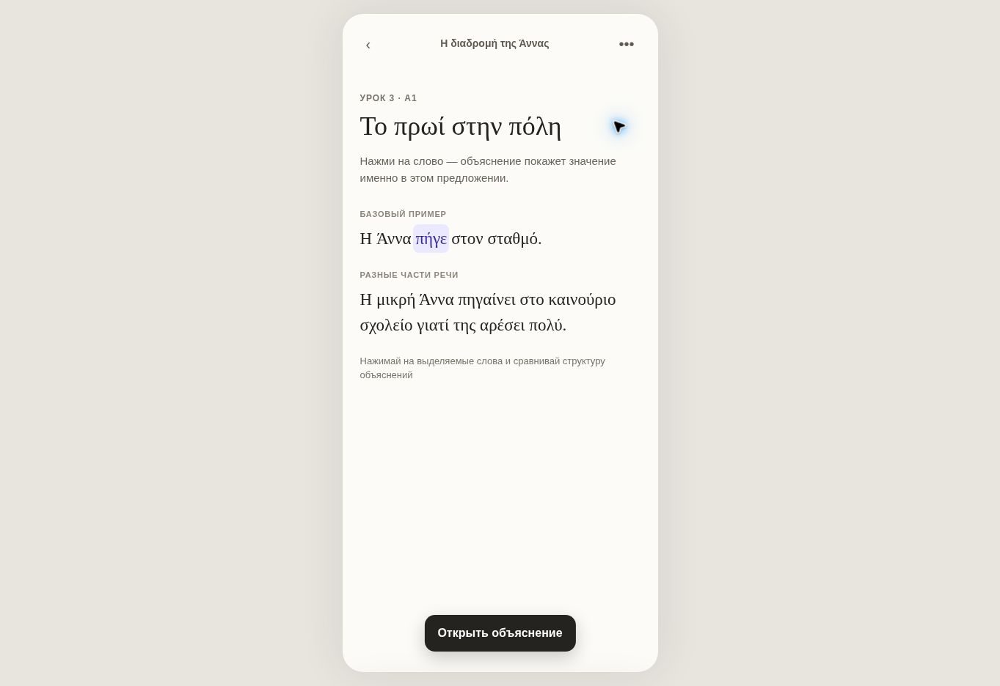
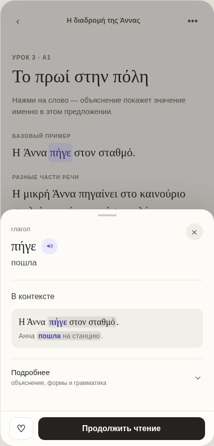
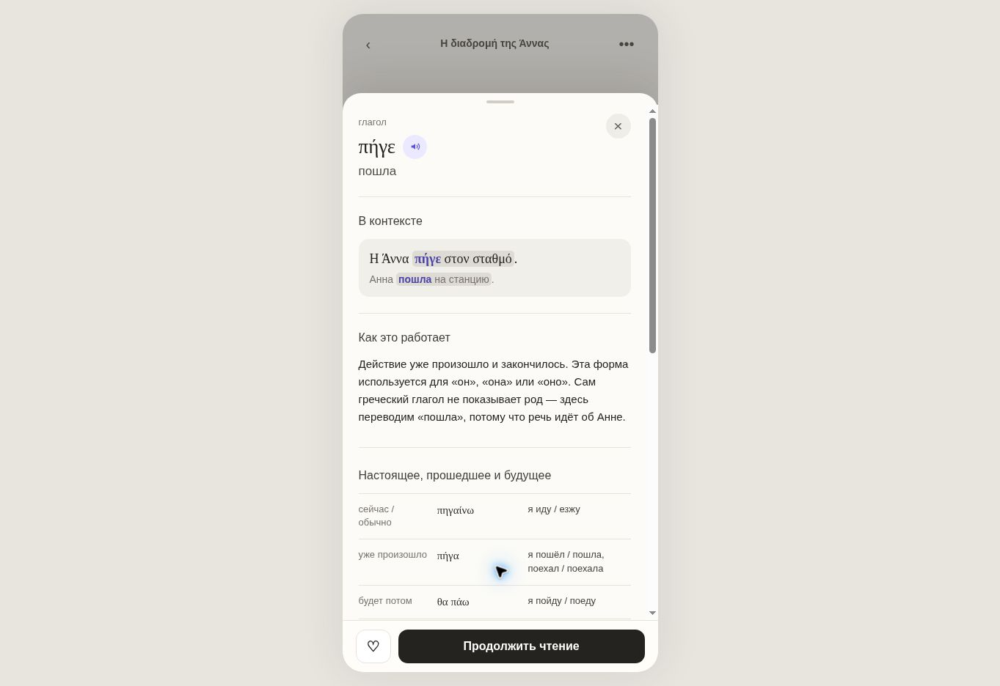
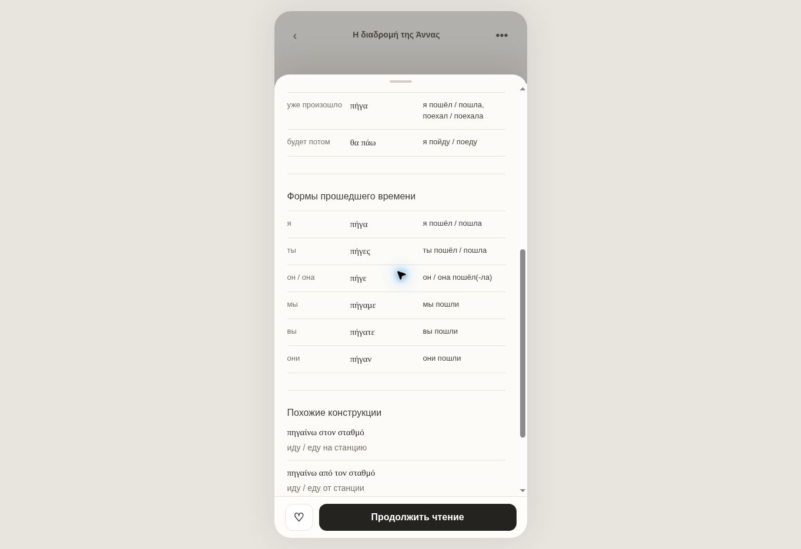
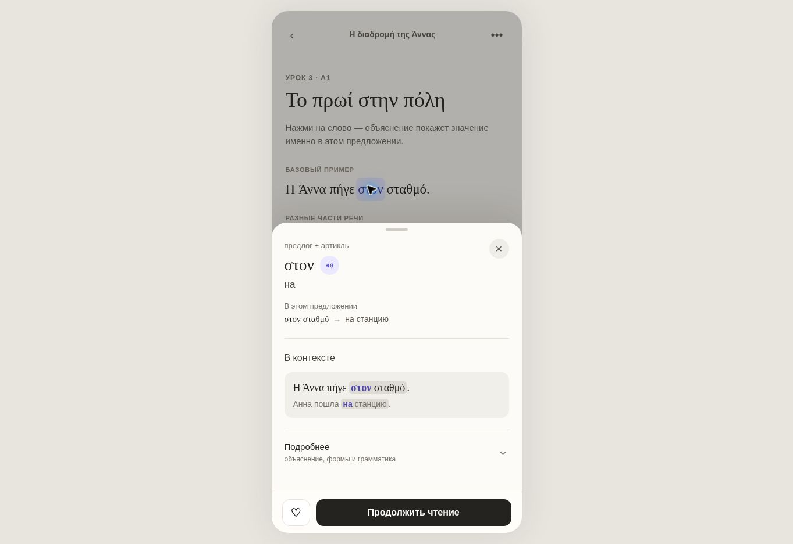
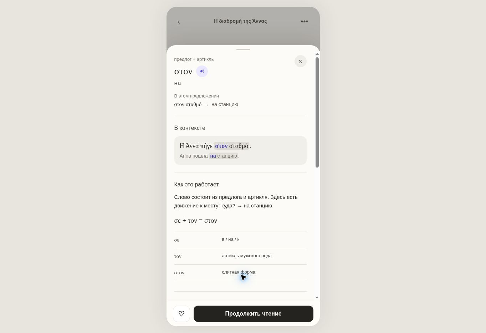

# Bottom sheet «Объяснение слова или фразы»

Статус: согласованная концепция для переноса в основной language-learning project.

## 1. Задача

Пользователь читает текст на изучаемом языке и нажимает на незнакомое слово. Bottom sheet должен быстро объяснить значение именно в этом контексте, не превращая чтение в урок грамматики. Для уровня A0–A1 сначала показывается простое объяснение; формы, термины и подробная грамматика раскрываются по запросу.

Перевод всего предложения остаётся отдельным режимом reader и не включается в этот bottom sheet.

## 2. Базовый сценарий

1. Каждое поддерживаемое слово в reader нажимаемо отдельно.
2. При необходимости система понимает связанную конструкцию вокруг выбранного слова.
3. Bottom sheet сразу показывает короткий ответ: выбранная форма, перевод и контекст.
4. Подробный разбор загружается только после нажатия `Подробнее`.
5. После раскрытия кнопка `Подробнее` исчезает; секции остаются открытыми до выбора другого слова.
6. Выбор нового слова сбрасывает sheet в короткое состояние для нового элемента.

Важно: `στον` и `σταθμό` — отдельные цели нажатия. AI может показать связь `στον σταθμό`, но не должен заменять ею точный выбранный элемент.

## 3. Короткое состояние

Порядок сверху вниз:

1. Часть речи спокойным обычным регистром.
2. Выбранная форма на изучаемом языке.
3. Кнопка озвучивания — существующая иконка и компонент проекта.
4. Контекстный перевод выбранной формы.
5. Опциональная связанная конструкция, только если она помогает понять смысл.
6. Секция `В контексте`: исходное предложение и естественный русский перевод.
7. `Подробнее` с подписью `объяснение, формы и грамматика` и шевроном вниз.
8. Закреплённые действия внизу.

### Выделение в контексте

- Выбранное слово: акцентный цвет + умеренное начертание medium/semibold.
- Не использовать тяжёлый bold.
- Связанная фраза: мягкий нейтрально-серый фон.
- Акцент выбранного слова остаётся видимым внутри серой связанной фразы.
- Русский перевод повторяет ту же смысловую разметку.

Пример для `πήγε`:

- выбранное слово — `πήγε`;
- связанная фраза — `πήγε στον σταθμό`;
- перевод выбранного слова — `пошла`;
- перевод связанной фразы — `пошла на станцию`.

## 4. Подробное состояние

Подробности — не фиксированный набор карточек. AI возвращает только секции, которые добавляют новое знание этому слову.

Типовая последовательность:

1. `Как это работает` — простое контекстное объяснение без лишних терминов.
2. Полезное сравнение форм или времён.
3. Формы слова / спряжение / изменение всей конструкции.
4. Похожие конструкции с переводом.
5. Короткая грамматическая справка — в самом конце и только при необходимости.

Не добавлять отдельный блок `Вместе`, если он лишь повторяет предложение из секции `В контексте`.

## 5. Эталон для глагола `πήγε`

### Короткое состояние

- Часть речи: `глагол`.
- Форма в тексте: `πήγε`.
- Перевод в контексте: `пошла`.
- Не показывать сверху строку `Словарная форма`.
- Объяснить род через контекст: сам греческий глагол род не кодирует; `пошла` выбрано, потому что речь об Анне.

### Сравнение времён

Сравнивать на одном лице — `я`, а не смешивать форму из предложения с разными лицами:

| Смысл | Греческий | Русский |
|---|---|---|
| сейчас / обычно | πηγαίνω | я иду / езжу |
| уже произошло | πήγα | я пошёл / пошла, поехал / поехала |
| будет потом | θα πάω | я пойду / поеду |

### Формы прошедшего времени

| Лицо | Греческий | Русский |
|---|---|---|
| я | πήγα | я пошёл / пошла |
| ты | πήγες | ты пошёл / пошла |
| он / она | πήγε | он / она пошёл(-ла) |
| мы | πήγαμε | мы пошли |
| вы | πήγατε | вы пошли |
| они | πήγαν | они пошли |

Строку с текущей формой `πήγε` отдельно не подсвечивать.

### Похожие конструкции

- `πηγαίνω στον σταθμό` → `иду / еду на станцию`;
- `πηγαίνω από τον σταθμό` → `иду / еду от станции`;
- `πηγαίνω με το λεωφορείο` → `еду на автобусе`.

Греческий текст здесь использует тот же стиль, что греческие формы в таблице. Новый типографический стиль не вводится.

## 6. Правила для разных типов слов

| Элемент | Что важно показать |
|---|---|
| `Άννα` | Выбрано только имя; мягко показать связанную конструкцию `η Άννα`; объяснить, что перед именами обычно стоит артикль. |
| `στον` | Выбран только `στον`; показать `στον σταθμό` как контекст; в подробностях объяснить `σε + τον = στον`. |
| `σταθμό` | Показать выбранную форму и словарную форму `ο σταθμός`; объяснить изменение формы после `σε`. |
| `μικρή` | Объяснить согласование с Анной; при необходимости показать мужской, женский и средний род; не повторять одну и ту же фразу в нескольких блоках. |
| артикль | Объяснить функцию, даже если отдельного русского перевода нет; показать род и связь с существительным. |
| предлог + артикль | Показать состав формы и роль всей конструкции, а не только механический перевод частей. |
| существительное | Разделять форму в тексте и начальную форму; формы выводить только если это полезно в текущем контексте. |
| союз / местоимение / наречие | Показывать значение конструкции и 2–3 реально полезных контрастных примера, без обязательной таблицы. |

Не переносить русские вопросы падежей буквально на греческий. Можно назвать греческий падеж и простыми словами объяснить его роль, но естественный русский перевод определяется всей конструкцией.

## 7. Типографика и визуальная система

- Использовать существующие шрифты, цвета, размеры и иконки основного проекта.
- Визуальный ориентир скриншотов: нейтральный минималистичный интерфейс, спокойная плотность и ясная иерархия.
- Основное слово не должно быть чрезмерно крупным.
- Никаких заголовков в CAPS внутри sheet.
- Не строить иерархию одновременно цветом, жирностью и плашкой.
- Заголовки секций — умеренное начертание, без тяжёлого bold.
- Подписи вроде `Форма в тексте`, `Начальная форма`, `Грамматика` — обычным начертанием.
- Таблицы располагаются прямо на основном фоне, без серых карточек.
- Строки таблиц разделяются тонкими линиями и отступами.
- Контекст может находиться на мягком сером фоне.
- Один акцентный цвет используется для выбранного слова и интерактивных элементов.

## 8. Поведение и доступность

- Bottom sheet закрывается крестиком, нажатием на scrim, жестом вниз и основной кнопкой продолжения чтения.
- Footer закреплён и не перекрывает прокручиваемое содержание.
- Кнопка озвучивания имеет доступное имя с конкретным словом.
- `Подробнее` сообщает состояние через `aria-expanded` или эквивалент нативной платформы.
- Таблицы должны оставаться читаемыми на узком мобильном экране; при необходимости перевод переносится на следующую строку без горизонтального скролла.
- Выбранное слово остаётся различимым не только по цвету.

## 9. Рекомендуемая архитектура AI/API

Не генерировать подробный ответ заранее и не скрывать его только визуально.

Рекомендуемый поток:

1. `POST /explain/summary` — быстрый короткий ответ для открытия sheet.
2. `POST /explain/details` — вызывается после `Подробнее` и возвращает только полезные секции.
3. Кэшировать подробный ответ на время урока или для конкретной версии текста.

UI должен рендерить секции по типу, а не по жёстко заданному порядку для всех частей речи. Подходящая модель данных приложена в `content-example.json`.

## 10. Скриншоты

### Общий reader и кликабельные элементы

### `πήγε`: короткое состояние

### `πήγε`: объяснение и времена

### `πήγε`: формы и похожие конструкции

### `στον`: короткое состояние

### `στον`: объяснение составной формы

## 11. Критерии приёмки

- Нажатие на `στον` и `σταθμό` открывает два разных объяснения.
- Короткий sheet `πήγε` не показывает строку `Словарная форма`.
- Шеврон `Подробнее` направлен вниз.
- Подробный запрос не отправляется до нажатия `Подробнее`.
- После раскрытия кнопка `Подробнее` исчезает.
- Для времён глагола показано `πηγαίνω → πήγα → θα πάω` в лице `я`.
- В таблице прошедшего времени текущая форма не выделена отдельным цветом или плашкой.
- Выбранное слово в контексте имеет умеренный цветной акцент; связанная фраза — мягкий серый фон.
- Внутри подробностей нет CAPS и серых карточек вокруг таблиц.
- Каждый греческий пример имеет естественный русский перевод.
- Нет секций, которые только повторяют уже показанное содержание.
- Остальные части речи используют те же визуальные правила, но получают только релевантные учебные секции.

